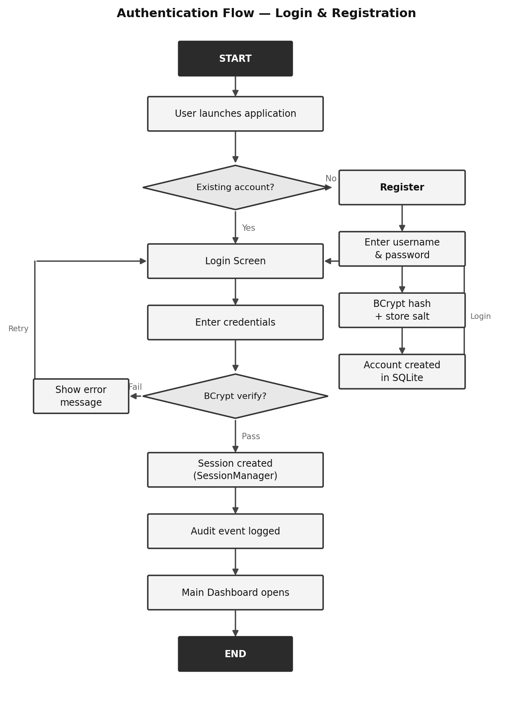
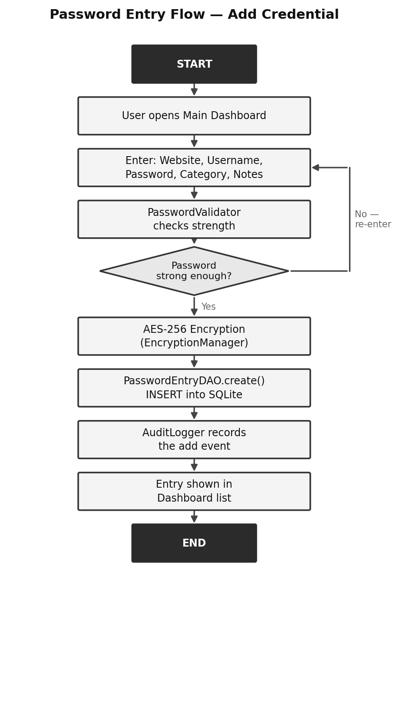

# 🔐 Password Vault Desktop Application

A professional, role-based password management system designed for maximum security and modularity. This application implements industry-standard encryption protocols and a clean, persona-driven architecture.

---

## Architecture

This project was developed by redistributing logic across five distinct developer personas, each responsible for a critical layer of the application:

### 🏗️ Infrastructure & Database Architect
**Focus: Foundation, Database Schema, and Core Security**
- **SQLite Schema:** Designed a normalised database with indices for high-performance lookups.
- **AES-256 Encryption:** Implemented high-level password storage using the standard Java Cryptography Extension (JCE).
- **BaseDAO:** Created an abstract persistence layer for consistent data access.

### 🖥️ UX/UI & Frontend Development — *Adarsh Kumar Singh (23BCE10566)*
**Focus: Swing GUI, Responsive Design, and User Flow**
- **Modular Windows:** Designed specialised screens for Login, Registration, and the Main Dashboard.
- **UI Consistency:** Implemented a `DialogFactory` for unified styling and solid-coloured buttons.
- **Responsive Layouts:** Ensured a clean, intuitive experience across different window sizes.

### 🔐 Authentication & Security Specialist
**Focus: User Identity, Sessions, and BCrypt Hashing**
- **BCrypt Hashing:** Implemented salted password hashing for user accounts.
- **Session Management:** Developed a thread-safe singleton for tracking active user states.
- **Audit Logging:** Integrated a security event tracker that records every login/action.

### ⚙️ Core Password Development
**Focus: Business Logic, CRUD, and Generation**
- **Secure CRUD:** Developed the primary service for adding, viewing, and deleting sensitive entries.
- **Password Generator:** Integrated a cryptographically secure random password generator.
- **Model Design:** Crafted the `PasswordEntry` and `Category` data models with validation.

### 📊 Data Management & Reporting
**Focus: Advanced Search, Filtering, and Portability**
- **Search Engine:** Built a full-text search engine with relevance scoring (Website > Username).
- **Export/Import:** Created an encrypted custom file format for secure data migration.
- **Dynamic Filters:** Developed a builder for complex category and date-based filtering.

---

## 👤 My Contribution — Adarsh Kumar Singh (23BCE10566)

I was responsible for the **UX/UI & Frontend Development** layer of this project. My module forms a critical architectural layer and resides entirely in the `src/main/java/com/passwordvault/ui/` package.

### Assigned Tasks

| Task | Name | Description |
|------|------|-------------|
| T2.1 | **Login & Registration Windows** | Designed and implemented `LoginWindow` and `RegistrationWindow` using Java Swing, including form validation, error feedback labels, and connection to `AuthService`. |
| T2.2 | **Main Dashboard** | Built `MainWindow` as the primary vault dashboard: password list table (JTable), category sidebar, search bar, and toolbar (add/edit/delete/generate/export buttons). |
| T2.3 | **Add/Edit Password Dialog** | Created `AddPasswordDialog` modal with all input fields, inline password generator button, show/hide toggle, strength indicator bar, and category selector. |
| T2.4 | **DialogFactory & UI Consistency** | Implemented `DialogFactory` as a centralised UI utility producing consistently styled modals, confirmation prompts, error dialogs, and color-coded buttons across all windows. |
| T2.5 | **Responsive Layouts & Polish** | Ensured all windows resize gracefully using `BorderLayout`/`GridBagLayout`. Applied consistent color scheme (navy/white/accent), fonts, and icon set throughout the app. |

### Source Files Owned

**Module package:** `src/main/java/com/passwordvault/ui/`

- `LoginWindow.java`
- `RegistrationWindow.java`
- `MainWindow.java`
- `AddPasswordDialog.java`
- `DialogFactory.java`
- `PasswordVaultApp.java`

### Deliverables

- `LoginWindow.java` and `RegistrationWindow.java` — authentication screens with validation
- `MainWindow.java` — full dashboard with all controls
- `AddPasswordDialog.java` — entry creation/edit modal
- `DialogFactory.java` — unified UI component factory
- `PasswordVaultApp.java` — application entry point

---

## Application Layer Architecture


*Figure 1 — Application Layer Architecture*

---

## Security Implementation

| Layer | Technology | Purpose |
|---|---|---|
| User Auth | BCrypt | Irreversible hashing for master passwords. |
| Data Storage | AES-256 (JCE) | Encryption of website credentials. |
| Persistence | SQLite | Local, encrypted file-based database. |
| Integrity | PRAGMA Foreign Keys | Enforcing data relationships in the vault. |

---

## Getting Started

### Prerequisites
- JDK 1.8 or higher
- Apache Maven 3.x

### Installation

1. **Clone the repository:**
   ```bash
   git clone https://github.com/Adarsh0414/password-Vault-Desktop-Application.git
   ```

2. **Navigate to the root directory:**
   ```bash
   cd "password vault desktop application"
   ```

3. **Build and Run:**
   ```bash
   mvn clean compile exec:java
   ```

### First-Time Use

- **Register:** Launch the app and click Register to create your local master account.
- **Login:** Enter your credentials to unlock the vault.
- **Manage:** Start adding your website credentials. Everything is encrypted on-the-fly.

---

## Authentication Flow



*Figure 2 — Authentication Flow (Login & Registration)*

---

## Password Entry Flow



*Figure 3 — Password Entry Flow (Add Credential)*

---

## Project Structure

```
src/main/java/com/passwordvault/
│
├── infrastructure/          # Foundation
│   ├── db/                  # Connection & Schema
│   ├── security/            # AES-256 Implementation
│   ├── data/                # BaseDAO Abstraction
│   └── exception/           # Error Handling
│
├── auth/                    # Security & Identity
│   ├── dao/                 # User Persistence
│   ├── service/             # Login / Registration
│   ├── security/            # BCrypt Logic
│   ├── logging/             # Audit Tracking
│   ├── session/             # Session Lifecycle
│   └── util/                # Password Validation
│
├── core/                    # Business Logic
│   ├── model/               # Core Data Models
│   ├── dao/                 # Password Entry Persist
│   └── service/             # Password Operations
│
├── data/                    # Reporting Layer
│   ├── service/             # Search / Export / Import
│   └── util/                # Advanced Filtering
│
└── ui/                      # Presentation Layer  ← Adarsh Kumar Singh
    ├── LoginWindow.java      # Authentication screen
    ├── RegistrationWindow.java # Registration screen
    ├── MainWindow.java       # Primary dashboard
    ├── AddPasswordDialog.java # Entry creation/edit modal
    ├── DialogFactory.java    # UI utility factory
    └── PasswordVaultApp.java # Entry point
```